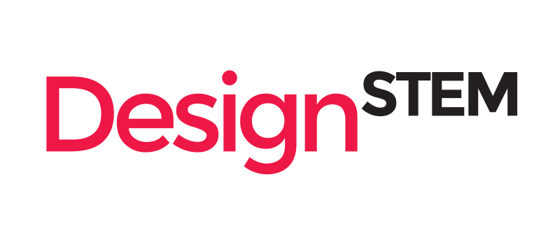

| id: start
| section: Designstem Erasmus +
| theme: dark
| background: assets/background.jpg
| tint: 0.85
| height: 100vh

<f-logo />

### *e-tools for the integrated education of design and STEM*

<var>The Creative and Co-operative Modus Operandi</var>

&nbsp;

    <!--   -->
    

---

| chapter: Workshops
| section: Kuressaare, Estonia, Dec 2016
| background: assets/kuressaare/kuressaare.jpg
| backgroundposition: 50% 50%
| theme: dark
| 1 
| 2
| 3 
| rows: 1fr auto 6vh

-

## *Kuressaare, Estonia <small><small>December 2016</small></small>*

-

---

| background: assets/kuressaare/02_creative_mood.jpg
| backgroundposition: 100% 50%
| tint: 0.4
| theme: dark
| 1 
| 2 
| 3
| rows: 1fr auto 6vh

-

## *Kick-off meeting*

-

---

| 1 2 3
| 4 4 4
| theme: dark
| rows: 1fr auto
| cols: 1fr 2fr 1fr
| style: text-align: right;

<f-image src="assets/kuressaare/kuressaare-torsten.jpg" style="--image-position:60% center" />

-

<f-image src="assets/kuressaare/03_creative_mood.jpg" />

-

<f-image src="assets/kuressaare/kuressaare-saar.jpg" style="--image-position:80% center" />

-

<em>Kick-off meeting in Kuressaare, Estonia, December 2016</em>

---

| section: Helsinki, Finland, February 2017
| background: assets/helsinki/helsinki.jpg
| backgroundposition: 50% 50%
| theme: dark
| 1 
| 2 
| 3
| rows: 1fr auto 6vh

-

## *Helsinki, Finland <small><small>February 2017</small></small>*

-

---

| background: assets/helsinki/06_creative_mood.jpg
| backgroundposition: 100% 50%
| theme: dark
| 1 1
| 2 3
| 4 4
| rows: 1fr auto 6vh

-

## *Background research and pedagogy workshop*

-

-

---

| 1 2 3
| 4 4 4
| theme: dark
| rows: 1fr auto
| cols: 1fr 2fr 2fr
| style: text-align: right;

<f-image src="assets/helsinki/01_creative_mood.jpg" style="--image-position:20% center" />

-

<f-image src="assets/helsinki/03_creative_mood.jpg" />

-

<f-image src="assets/helsinki/12_creative_mood.jpg" />

-

<em>Background research and pedagogy workshop in Helsinki, Finland, February 2017</em>

---

| 1 2 3
| 4 4 4
| theme: dark
| rows: 1fr auto
| cols: 1fr 2fr 1fr
| style: text-align: right;

<f-image src="assets/helsinki/09_creative_mood.jpg" style="background-position:60% center" />

-

<f-image src="assets/helsinki/14_creative_mood.jpg" style="background-position:50% center" />

-

<f-image src="assets/helsinki/13_creative_mood.jpg" style="background-position:90% bottom" />

-

<em>Background research and pedagogy workshop in Helsinki, Finland, February 2017</em>

---

| background: assets/piraeus/greece.jpg
| theme: dark
| 1 
| 2 
| 3
| rows: 1fr auto 6vh
| section: Piraeus, Greece, May-June 2017

-

## *Piraeus, Greece <small><small>May-June 2017</small></small>*

-

---

| background: assets/piraeus/03_creative_mood.jpg
| theme: dark
| 1 
| 2 
| 3
| rows: 1fr auto 6vh

-

## *Brainstorming workshop*

-

---

| 1 2
| 3 3
| theme: dark
| rows: 1fr auto
| cols: 1fr 2fr
| style: text-align: right;

<f-image src="assets/piraeus/10_creative_mood.jpg" />

-

<f-image src="assets/piraeus/02_creative_mood.jpg" />

-

<em>Brainstorming workshop in Piraeus, Greece, May-June 2017</em>

---

| 1 2 3
| 4 4 4
| theme: dark
| rows: 1fr auto
| cols: 2fr 2fr 1fr
| style: text-align: right;

<f-image src="assets/piraeus/05_creative_mood.jpg" style="background-position:20% center" />

-

<f-image src="assets/piraeus/04_creative_mood.jpg" />

-

<f-image src="assets/piraeus/06_creative_mood.jpg" />

-

<em>Brainstorming workshop in Piraeus, Greece, May-June 2017</em>

---

| section: Middlesbrough, UK, October 2017
| background: assets/middlesbrough/middlesbrough.jpg
| tint: 0.5
| theme: dark
| 1
| 2
| 3
| rows: 1fr auto 6vh

-

## *Middlesbrough, UK <small><small>October 2017</small></small>*

-

---

| background: assets/middlesbrough/16_creative_mood.jpg
| backgrondposition: 75% 10%
| theme: dark
| 1
| 2
| 3
| rows: 1fr auto 6vh
| cols: 40vw

-

## *Presentation and improvement of initial ideas*

-

---

| 1 2 3
| 4 4 4
| theme: dark
| rows: 1fr auto
| cols: 1fr 3fr 2fr
| style: text-align: right;

<f-image src="assets/middlesbrough/10_creative_mood.jpg" style="background-position: 33% center" />

-

<f-image src="assets/middlesbrough/02_creative_mood.jpg" style="background-position: 27% center" />

-

<f-image src="assets/middlesbrough/10_creative_mood.jpg" style="background-position: 90% center" />

-

<em>Presentation and improvement of initial ideas in Middlesbrough, UK,  October 2017</em>

---

| 1 2 3
| 4 4 4
| theme: dark
| rows: 1fr auto
| cols: 2fr 1fr 1fr
| style: text-align: right;

<f-image src="assets/middlesbrough/19_creative_mood.jpg" style="--image-position:65% center" />

-

<f-image src="assets/middlesbrough/15_creative_mood.jpg" />

-

<f-image src="assets/middlesbrough/08_creative_mood.jpg" style="background-position: 50% center" />

-

<em>Presentation and improvement of initial ideas in Middlesbrough, UK, October 2017</em>

---

| section: Novo Mesto, Slovenia, March 2018
| background: assets/novomesto/01_creative_mood.jpg
| backgroundposition: 100% 50%
| theme: dark
| 1
| 2 
| 3
| rows: 1fr auto 6vh

-

## *Novo Mesto, Slovenia <small><small>March 2018</small></small>*

-

---

| background: assets/novomesto/cover.jpg
| backgroundposition: 70% 50%
| theme: dark
| 1
| 2
| 3
| rows: 1fr auto 6vh
| cols: 40vw

-

## *E-learning and media workshop*

-

---

| 1 2 3
| 4 4 4
| theme: dark
| rows: 1fr auto
| cols: 2fr 1fr 1fr
| style: text-align: right;

<f-image src="assets/novomesto/08_creative_mood.jpg" style="background-position:15% center" />

-

<f-image src="assets/novomesto/03_creative_mood.jpg" style="background-position:left center" />

-

<f-image src="assets/novomesto/06_creative_mood.jpg" />

-

<em>E-learning and media workshop in Novo Mesto, Slovenia, March 2018</em>

---

| 1 2 3
| 4 4 4
| theme: dark
| rows: 1fr auto
| cols: 1fr 2fr 1fr
| style: text-align: right;

<f-image src="assets/novomesto/12_creative_mood.jpg" />

-

<f-image src="assets/novomesto/09_creative_mood.jpg" style="background-position:50% 0" />

-

<f-image src="assets/novomesto/10_creative_mood.jpg" />

-

<em>E-learning and media workshop in Novo Mesto, Slovenia, March 2018</em>

---

| section: Amsterdam, the Netherlands, May 2018
| background: assets/amsterdam/amsterdam.jpg
| backgroundposition: 80% 50%
| theme: dark
| 1
| 2
| 3
| rows: 1fr auto 6vh

-

## *Amsterdam, the Netherlands <small><small>May 2018</small></small>*

-

---

| background: assets/amsterdam/01_creative_mood.jpg
| backgroundposition: 50% 33%
| theme: dark
| 1
| 2
| 3
| rows: 1fr auto 6vh
| cols: 40vw

-

## *Building and testing e-learning projects*

-

---

| 1 2 3
| 4 4 4
| theme: dark
| rows: 1fr auto
| style: text-align: right;

<f-image src="assets/amsterdam/04_creative_mood.jpg" />

-

<f-image src="assets/amsterdam/05_creative_mood.jpg" />

-

<f-image src="assets/amsterdam/16_creative_mood.jpg" />

-

<em>Building and testing e-learning projects in Amsterdam, the Netherlands, May 2018</em>

---

| 1 2 3
| 4 4 4
| theme: dark
| rows: 1fr auto
| style: text-align: right;

<f-image src="assets/amsterdam/14_creative_mood.jpg" style="background-position:60% center"  />

-

<f-image src="assets/amsterdam/07_creative_mood.jpg" />

-

<f-image src="assets/amsterdam/18_creative_mood.jpg" style="background-position:88% 75%" />

-

<em>Building and testing e-learning projects in Amsterdam, the Netherlands, May 2018</em>

---

| section: Trento, Italy, October 2018
| background: assets/trento/trento.jpg
| backgroundposition: 5% 50%
| theme: dark
| 1 
| 2 
| 3
| rows: 1fr auto 6vh

-

## *Trento, Italy <small><small>October 2018</small></small>*

-

---

| background: assets/trento/01_creative_mood.jpg
| backgroundposition: 95% 50%
| theme: dark
| 1
| 2
| 3
| rows: 1fr auto 6vh
| cols: 40vw

-

## *Introduction to web platform Fachwerk and testing*

-

---

| 1 2 3
| 4 4 4
| theme: dark
| rows: 1fr auto
| cols: 1fr 1fr 2fr
| style: text-align: right;

<f-image src="assets/trento/14_creative_mood.jpg" />

-

<f-image src="assets/trento/10_creative_mood.jpg" style="background-position:75% center" />

-

<f-image src="assets/trento/09_creative_mood.jpg" />

-

<em>Introduction to web platform Fachwerk and testing in Trento, Italy, October 2018</em>

---

| 1 2 3
| 4 4 4
| theme: dark
| rows: 1fr auto
| cols: 1fr 1fr 2fr
| style: text-align: right;

<f-image src="assets/trento/06_creative_mood.jpg" style="background-position:25% center" />

-

<f-image src="assets/trento/04_creative_mood.jpg" />

-

<f-image src="assets/trento/15_creative_mood.jpg" style="--image-position:30% center" />

-

<em>Introduction to web platform Fachwerk and testing in Trento, Italy, October 2018</em>

---

| section: Braganca, Portugal, March 2019
| background: assets/braganca/braganca.jpg
| backgroundposition: 75% 50%
| theme: dark
| 1 
| 2 
| 3
| rows: 1fr auto 6vh

-

## *Braganca, Portugal <small><small>March 2019</small></small>*

-

---

| background: assets/braganca/01_creative_mood.jpg
| backgroundposition: 75% 50%
| theme: dark
| 1 
| 2 
| 3
| rows: 1fr auto 6vh
| cols: 33vw

-

## *Final improvements and testing*

-

---

| 1 2 3
| 4 4 4
| theme: dark
| rows: 1fr auto
| cols: 1fr 2fr 1fr
| style: text-align: right;

<f-image src="assets/braganca/04_creative_mood.jpg" style="--image-position:80% center" />

-

<f-image src="assets/braganca/02_creative_mood.jpg" />

-

<f-image src="assets/braganca/06_creative_mood.jpg" />

-

<em>Final improvements in Braganca, Portugal, March 2019</em>

---

| 1 2 3
| 4 4 4
| theme: dark
| rows: 1fr auto
| style: text-align: right;

<f-image src="assets/braganca/08_creative_mood.jpg" style="--image-position:30% center" />

-

<f-image src="assets/braganca/14_creative_mood.jpg" style="--image-position:30% center" />

-

<f-image src="assets/braganca/03_creative_mood.jpg" />

-

<em>Final improvements in Braganca, Portugal, March 2019</em>

---

| background: assets/frankfurt/frankfurt.jpg
| theme: dark
| 1
| 2
| 3
| rows: 1fr auto 6vh
| section: Frankfurt, Germany, May 2019

-

## *Frankfurt, Germany <small><small>May 2019</small></small>*

-

---

| background: assets/frankfurt/01_creative_mood.jpg
| theme: dark
| 1
| 2
| 3
| rows: 1fr auto 6vh
| cols: 40vw

-

## *Dissemination and final reporting meeting*

-

---

| 1 2 3
| 4 4 4
| theme: dark
| rows: 1fr auto
| cols: 2fr 2fr 1fr
| style: text-align: right;

<f-image src="assets/frankfurt/09_creative_mood.jpg" style="--image-position:10% center" />

-

<f-image src="assets/frankfurt/02_creative_mood.jpg" style="--image-position:80% center" />

-

<f-image src="assets/frankfurt/03_creative_mood.jpg" />

-

<em>Dissemination and final reporting meeting Frankfurt, Germany, May 2019</em>

---

| 1 2 3
| 4 4 4
| theme: dark
| rows: 1fr auto
| cols: 1fr 3fr 2fr
| style: text-align: right;

<f-image src="assets/frankfurt/05_creative_mood.jpg" style="--image-position:15% center" />

-

<f-image src="assets/frankfurt/10_creative_mood.jpg" style="--image-position:10% 0%" />

-

<f-image src="assets/frankfurt/04_creative_mood.jpg" style="--image-position:80% center; transform:scaleX(-1)" />

-

<em>Dissemination and final reporting meeting Frankfurt, Germany, May 2019</em>

---

| background: assets/braganca/00_group.jpg
| theme: dark

<h2 style="text-align:center; margin-top:5vh;">
    Until next time!
</h2>
