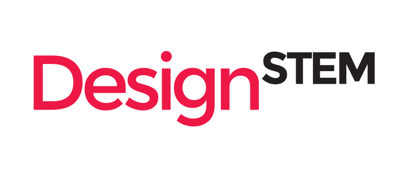

| chapter: Introduction
| section: DesignSTEM logo animation

<video autoplay loop>
    <source src="assets/intro.mp4"
            type="video/mp4">

    Sorry, your browser doesn't support embedded videos.
</video>

---

| section: Designstem Erasmus +

## <big>DesignSTEM: e-tools for the integrated   education of design and STEM<big/>

<var>The Creative and Co-operative Modus Operandi</var>

     
    

---

| background: assets/kuressaare/02_creative_mood.jpg
| theme: dark
| 1 
| 2 
| rows: 1fr auto
| chapter: Galleries
| section: Kuressaare, Estonia, Dec 2016
| style: background-position: right center

-

## <em>Kick-off meeting   <small><small>Kuressaare, Estonia, December 2016</small></small></em>

---

| 1 2 3
| 4 4 4
| theme: dark
| rows: 1fr auto
| style: text-align: right;

<f-image src="assets/kuressaare/01_creative_mood.jpg" />

-

<f-image src="assets/kuressaare/03_creative_mood.jpg" />

-

<f-image src="assets/kuressaare/05_creative_mood.jpg" style="background-position:left top" />

-

<em>Kick-off meeting in Kuressaare, Estonia, December 2016</em>

---

| background: assets/helsinki/06_creative_mood.jpg
| theme: dark
| 1 1
| 2 3
| rows: 1fr auto
| section: Helsinki, Finland, February 2017

-

## <em>Background research and pedagogy workshop   <small><small>Helsinki, Finland, February 2017</small></small></em>

---

| 1 2 3
| 4 4 4
| theme: dark
| rows: 1fr auto
| style: text-align: right;

<f-image src="assets/helsinki/01_creative_mood.jpg" />

-

<f-image src="assets/helsinki/03_creative_mood.jpg" />

-

<f-image src="assets/helsinki/05_creative_mood.jpg" />

-

<em>Background research and pedagogy workshop in Helsinki, Finland, February 2017</em>

---

| 1 2 3
| 4 4 4
| theme: dark
| rows: 1fr auto
| style: text-align: right;

<f-image src="assets/helsinki/12_creative_mood.jpg" />

-

<f-image src="assets/helsinki/09_creative_mood.jpg" />

-

<f-image src="assets/helsinki/10_creative_mood.jpg" />

-

<em>Background research and pedagogy workshop in Helsinki, Finland, February 2017</em>

---

| 1 2 3
| 4 4 4
| theme: dark
| rows: 1fr auto
| style: text-align: right;

<f-image src="assets/helsinki/13_creative_mood.jpg" style="background-position:right bottom" />

-

<f-image src="assets/helsinki/14_creative_mood.jpg" style="background-position:70% center" />

-

<f-image src="assets/helsinki/15_creative_mood.jpg" />

-

<em>Background research and pedagogy workshop in Helsinki, Finland, February 2017</em>

---

| background: assets/piraeus/01_creative_mood.jpg
| tint: 0.5
| theme: dark
| 1 
| 2 
| rows: 1fr auto
| section: Piraeus, Greece, May-June 2017

-

## <em>Brainstorming workshop <small><small>Piraeus, Greece, May-June 2017</small></small></em>

---

| 1 2
| 3 3
| theme: dark
| rows: 1fr auto
| cols: 1fr 2fr
| style: text-align: right;

<f-image src="assets/piraeus/10_creative_mood.jpg" />

-

<f-image src="assets/piraeus/02_creative_mood.jpg" />

-

<em>Brainstorming workshop in Piraeus, Greece, May-June 2017</em>

---

| 1 2 3
| 4 4 4
| theme: dark
| rows: 1fr auto
| style: text-align: right;

<f-image src="assets/piraeus/04_creative_mood.jpg" />

-

<f-image src="assets/piraeus/06_creative_mood.jpg" />

-

<f-image src="assets/piraeus/05_creative_mood.jpg" style="background-position:20% center" />

-

<em>Brainstorming workshop in Piraeus, Greece, May-June 2017</em>

---

| background: assets/middlesbrough/01_creative_mood.jpg
| theme: dark
| 1 1
| 2 3
| rows: 1fr auto
| section: Middlesbrough, UK, October 2017

-

## <em>Initial ideas’ improvement  <small><small>Middlesbrough, UK, October 2017</small></small></em>

-

---

| 1 2 3
| 4 4 4
| theme: dark
| rows: 1fr auto
| style: text-align: right;

<f-image src="assets/middlesbrough/08_creative_mood.jpg" style="background-position: 40% center" />

-

<f-image src="assets/middlesbrough/02_creative_mood.jpg" style="background-position: 27% center" />

-

<f-image src="assets/middlesbrough/10_creative_mood.jpg" style="background-position: 70% center" />

-

<em>Initial ideas’ improvement in Middlesbrough, UK,  October 2017</em>

---

| 1 2 3
| 4 4 4
| theme: dark
| rows: 1fr auto
| style: text-align: right;

<f-image src="assets/middlesbrough/19_creative_mood.jpg" />

-

<f-image src="assets/middlesbrough/15_creative_mood.jpg" />

-

<f-image src="assets/middlesbrough/16_creative_mood.jpg" />

-

<em>Initial ideas’ improvement in Middlesbrough, UK, October 2017</em>

---

| 1 
| 2
| theme: dark
| rows: 1fr auto
| style: text-align: right;

<f-image src="assets/middlesbrough/18_creative_mood.jpg" />

-

<em>Initial ideas’ improvement in Middlesbrough, UK, October 2017</em>

---

| background: assets/novomesto/01_creative_mood.jpg
| theme: dark
| 1 1
| 2 3
| rows: 1fr auto
| section: Novo Mesto, Slovenia, March 2018
| style: background-position: 100% center

-

## <em>E-learning and media workshop <small><small>Novo Mesto, Slovenia, March 2018</small></small></em>

-

---

| 1 2 3
| 4 4 4
| theme: dark
| rows: 1fr auto
| style: text-align: right;

<f-image src="assets/novomesto/08_creative_mood.jpg" style="background-position:15% center" />

-

<f-image src="assets/novomesto/03_creative_mood.jpg" style="background-position:left center" />

-

<f-image src="assets/novomesto/06_creative_mood.jpg" />

-

<em>E-learning and media workshop in Novo Mesto, Slovenia, March 2018</em>

---

| 1 2 3
| 4 4 4
| theme: dark
| rows: 1fr auto
| cols: 1fr 2fr 1fr
| style: text-align: right;

<f-image src="assets/novomesto/12_creative_mood.jpg" />

-

<f-image src="assets/novomesto/09_creative_mood.jpg" style="background-position:50% 0" />

-

<f-image src="assets/novomesto/10_creative_mood.jpg" />

-

<em>E-learning and media workshop in Novo Mesto, Slovenia, March 2018</em>

---

| background: assets/amsterdam/01_creative_mood.jpg
| theme: dark
| 1 1
| 2 2
| rows: 1fr auto
| section: Amsterdam, the Netherlands, May 2018
| style: background-position: center 33%

-

## <em>Building and testing e-learning projects <small><small>Amsterdam, the Netherlands, May 2018</small></small></em>

---

| 1 2 3
| 4 4 4
| theme: dark
| rows: 1fr auto
| style: text-align: right;

<f-image src="assets/amsterdam/04_creative_mood.jpg" />

-

<f-image src="assets/amsterdam/05_creative_mood.jpg" />

-

<f-image src="assets/amsterdam/16_creative_mood.jpg" />

-

<em>Building and testing e-learning projects in Amsterdam, the Netherlands, May 2018</em>

---

| 1 2 3
| 4 4 4
| theme: dark
| rows: 1fr auto
| style: text-align: right;

<f-image src="assets/amsterdam/14_creative_mood.jpg" style="background-position:60% center"  />

-

<f-image src="assets/amsterdam/07_creative_mood.jpg" />

-

<f-image src="assets/amsterdam/18_creative_mood.jpg" style="background-position:88% 75%" />

-

<em>Building and testing e-learning projects in Amsterdam, the Netherlands, May 2018</em>

---

| background: assets/trento/01_creative_mood.jpg
| theme: dark
| 1 1
| 2 3
| rows: 1fr auto
| section: Trento, Italy, October 2018

-

## <em>Introduction to web platform Fachwerk and testing <small><small>Trento, Italy, October 2018</small></small></em>

-

---

| 1 2 3
| 4 4 4
| theme: dark
| rows: 1fr auto
| cols: 1fr 1fr 2fr
| style: text-align: right;

<f-image src="assets/trento/14_creative_mood.jpg" />

-

<f-image src="assets/trento/10_creative_mood.jpg" style="background-position:75% center" />

-

<f-image src="assets/trento/09_creative_mood.jpg" />

-

<em>Introduction to web platform Fachwerk and testing in Trento, Italy, October 2018</em>

---

| 1 2 3
| 4 4 4
| theme: dark
| rows: 1fr auto
| cols: 1fr 1fr 2fr
| style: text-align: right;

<f-image src="assets/trento/06_creative_mood.jpg" style="background-position:25% center" />

-

<f-image src="assets/trento/04_creative_mood.jpg" />

-

<f-image src="assets/trento/15_creative_mood.jpg" />

-

<em>Introduction to web platform Fachwerk and testing in Trento, Italy, October 2018</em>

---

| background: assets/braganca/01_creative_mood.jpg
| theme: dark
| 1 
| 2 
| rows: 1fr auto
| section: Braganca, Portugal, March 201

-

## <em>Final improvements and testing <small><small>Braganca, Portugal, March 2019</small></small></em>

---

| 1 2 3
| 4 4 4
| theme: dark
| rows: 1fr auto
| style: text-align: right;

<f-image src="assets/braganca/02_creative_mood.jpg" />

-

<f-image src="assets/braganca/03_creative_mood.jpg" />

-

<f-image src="assets/braganca/04_creative_mood.jpg" />

-

<em>Final improvements in Braganca, Portugal, March 2019</em>

---

| 1 2 3
| 4 4 4
| theme: dark
| rows: 1fr auto
| style: text-align: right;

<f-image src="assets/braganca/05_creative_mood.jpg" />

-

<f-image src="assets/braganca/06_creative_mood.jpg" />

-

<f-image src="assets/braganca/07_creative_mood.jpg" />

-

<em>Final improvements in Braganca, Portugal, March 2019</em>

---

| 1 2 3
| 4 4 4
| theme: dark
| rows: 1fr auto
| style: text-align: right;

<f-image src="assets/braganca/08_creative_mood.jpg" />

-

<f-image src="assets/braganca/09_creative_mood.jpg" />

-

<f-image src="assets/braganca/10_creative_mood.jpg" />

-

<em>Final improvements in Braganca, Portugal, March 2019</em>

---

| 1 2 3
| 4 4 4
| theme: dark
| rows: 1fr auto
| style: text-align: right;

<f-image src="assets/braganca/11_creative_mood.jpg" />

-

<f-image src="assets/braganca/12_creative_mood.jpg" />

-

<f-image src="assets/braganca/13_creative_mood.jpg" />

-

<em>Final improvements in Braganca, Portugal, March 2019</em>

---

| 1 2 3
| 4 4 4
| theme: dark
| rows: 1fr auto
| style: text-align: right;

<f-image src="assets/braganca/14_creative_mood.jpg" />

-

<f-image src="assets/braganca/15_creative_mood.jpg" />

-

<f-image src="assets/braganca/16_creative_mood.jpg" />

-

<em>Final improvements in Braganca, Portugal, March 2019</em>

---

| 1 2
| 3 3
| theme: dark
| rows: 1fr auto
| style: text-align: right;

<f-image src="assets/braganca/17_creative_mood.jpg" />

-

<f-image src="assets/braganca/18_creative_mood.jpg" />

-

<em>Final improvements in Braganca, Portugal, March 2019</em>

---

| background: assets/frankfurt/01_creative_mood.jpg
| theme: dark
| 1 1
| 2 3
| rows: 1fr auto
| section: Frankfurt, Germany, May 2019

-

## <em>Dissemination and final reporting meeting Frankfurt, Germany, May 2019</em>

-

---

| 1 2 3
| 4 4 4
| theme: dark
| rows: 1fr auto
| style: text-align: right;

<f-image src="assets/frankfurt/02_creative_mood.jpg" />

-

<f-image src="assets/frankfurt/03_creative_mood.jpg" />

-

<f-image src="assets/frankfurt/04_creative_mood.jpg" />

-

<em>Dissemination and final reporting meeting Frankfurt, Germany, May 2019</em>

---

| 1 2 3
| 4 4 4
| theme: dark
| rows: 1fr auto
| style: text-align: right;

<f-image src="assets/frankfurt/05_creative_mood.jpg" />

-

<f-image src="assets/frankfurt/06_creative_mood.jpg" />

-

<f-image src="assets/frankfurt/08_creative_mood.jpg" />

-

<em>Dissemination and final reporting meeting Frankfurt, Germany, May 2019</em>

---

| 1 2
| 3 3
| theme: dark
| rows: 1fr auto
| style: text-align: right;

<f-image src="assets/frankfurt/09_creative_mood.jpg" />

-

<f-image src="assets/frankfurt/10_creative_mood.jpg" />

-

<em>Dissemination and final reporting meeting Frankfurt, Germany, May 2019</em>

---

| background: assets/middlesbrough/GRUPP.jpg
| style: background-size: contain; background-position: center; text-align: center;
| theme: dark

# <var>Til' next time!</var>
