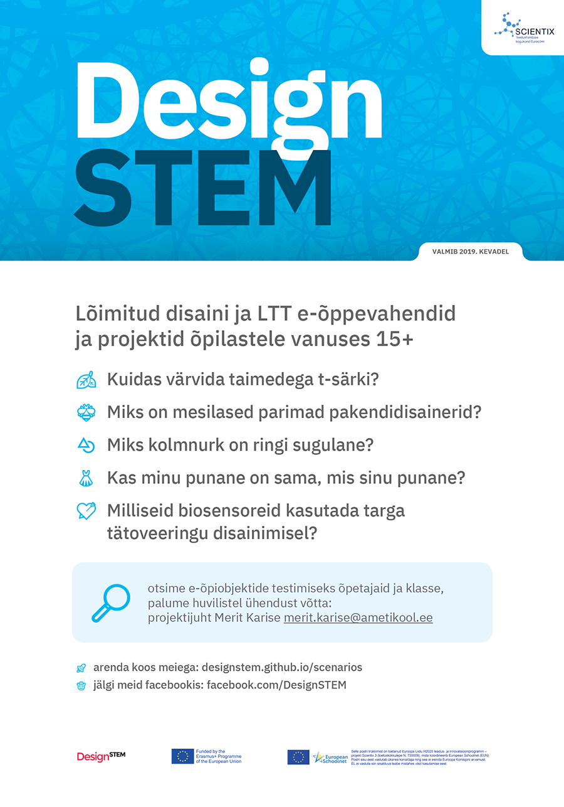

<f-scene width="200" height="200">
	<f-spin-pattern>
	<f-slice-pattern r="1">
		<f-box
			:position="get('p',[])[0]"
			:fill="color('red')"
			r="1"
			stroke
		/>
    <f-circle
			:position="get('p',[])[1]"
			:fill="color('darkred')"
			stroke
			r="0.75"
		/>
		<f-hexagon
			:position="get('p',[])[2]"
			:fill="color('yellow')"
			stroke
			r="0.75"
		/>
		<f-regularpolygon
			count="5"
			:position="get('p',[])[3]"
			:fill="color('orange')"
			stroke
			r="0.75"
		/>
	</f-slice-pattern>
	</f-spin-pattern>
</f-scene>

# <big><big>DesignSTEM&nbsp;2.0</big></big>

<f-scene v-slot="{ mouse }" width="200" height="200">
  <f-drag
    :mouse="mouse"
    points="0.5 -0.5, -0.5 0.5, -0.5 -0.5, 0.5 0.5"
    v-slot="{ points }"
    set="p"
  >
		<f-box
			:position="points[0]"
			:fill="color('red')"
			stroke
			r="1"
		/>
    <f-circle
			:position="points[1]"
			:fill="color('darkred')"
			stroke
			r="0.75"
		/>
		<f-hexagon
			:position="points[2]"
			:fill="color('yellow')"
			stroke
			r="0.75"
		/>
		<f-regularpolygon
			count="5"
			:position="points[3]"
			:fill="color('orange')"
			stroke
			r="0.75"
		/>
  </f-drag>
</f-scene>

---

| 1 1 1
| 2 3 4
| 5 6 7

# Probleemid

-

#### Õpilaste kesised <f-sidebar title="STEAM" src="./steam.md" /> oskused

-

#### <f-sidebar title="21. sajandi oskuste" src="./21.md" /> vähene omandamine

-

#### Kestliku arengu eesmärkide vähene sidumine õpieesmärkidega

-

#### <f-sidebar title="LTT" src="./ltt.md" /> ja <f-sidebar title="STEAM" src="./steam.md" /> õpetajate (järelkasvu) puudus  ning väike võimekus luua atraktiivseid õppematerjale

-

#### Õppematerjalide puudus, mis käsitleks <f-sidebar title="STEAMi" src="./steam.md" /> interaktiivselt, kaasaegselt ja eestikeelselt

-

#### Tehnilise platvormi puudus, mis võimaldaks kasutajasõbralikult integeerida teksti-, pildi-, video-, 3D- ja VR-sisu

---

| height: 50vh
| 1 1 5 5
| 2 3 6 6
| 4 4 6 6

<f-animation :loop="false" set="c1" to="1000" duration="900" easing="easeOutCubic" integer />

<f-animation :loop="false" set="c2" to="100" duration="900" easing="easeOutCubic" integer />

<f-animation :loop="false" set="c3" to="20" duration="900" easing="easeOutCubic" integer />

<f-animation :loop="false" set="c4" to="5" duration="900" easing="easeOutCubic" integer />

# Lahendus

-

# <big><big>{{ get('c4') }}</big></big>

õpetajat ja disainerit koolitavad

-

# <big><big>{{ get('c3') }}</big></big>

kuu jooksul

-

# <big><big>{{ get('c1') }}</big></big>

õpilast, õpetajaks õppijat ja õpetajat looma **STEAM õpiprojekte**

-

# Mõju

-

<ul>
<li>

Kaasaegse, rakendusliku STEAM õppe **kaalukas levi** keskhariduses

</li>
<li>

21. sajandi oskuste <b>kõrgem tase</b> keskharidusõppijatel
</li>
<li>

Kestliku arengu eesmärkide **orgaaniline sidumine** formaalhariduse õpieesmärkidega

</li>
<li>

STEAM / disaini erialade **populaarsuse kasv** edasiõppimiseks

</li>
<li>

STEAM õpetajaameti **maine tõus** õpilaste silmis ja avalikkuses laiemalt

</li>
</ul>

---

| padding: 0
| gap: 0

| 1 2 3 4 5 6
| 7 7 8 8 9 9
| 7 7 8 8 9 9

<f-image src="./images/1.jpg" />

-

<f-image src="./images/5.jpg" />

-

<f-image src="./images/4.jpg" />

-

<f-image src="./images/8.jpg" />

-

<f-image src="./images/2.jpg" />

-

<f-image src="./images/6.jpg" />

-

<section>

## Tehtud 2016-2019

**DesignSTEM 1.0**

10 riigi kutse- ja kõrgkooli LTT/disaini e-õppematerjalide loomise koostööprojekt <f-sidebar title="Helsingi ülikooli" src="./helsinki.md" /> LUMA keskuse metoodilisel juhendamisel.

<f-sidebar title="20 õpiprojekti" width="40vw"></f-sidebar> on lõppastme arendusjärgus ja neid on testinud **50 LTT/disaini õpetajat ja õpilast** Eestis, Hollandis, Portugalis ja Itaalias.

</section>

-

<section>

## &nbsp;

<strong>Veebiraamistik <a href="https://designstem.github.io/fachwerk" target="_blank">Fachwerk</a></strong> <f-arrow-icon rotation="-45" />

Vabavaraline raamistik aitab luua atraktiivset õpikeskkonda, mis sisaldab <a v-on:click="set('s',1)" style="cursor:pointer;">dünaamilist matemaatikat</a> , <a v-on:click="set('s',2)" style="cursor:pointer;">3D-mudeleid</a>, generatiivset <a v-on:click="set('s',0)" style="cursor:pointer;">disaini</a>, VR-elamusi ja palju teisi koodipõhiseid interaktiivseid elemente.

Kõiki materjale saab lihtsalt <a v-on:click="send('edit')" style="cursor:pointer;">muuta</a>, kohandada ja jagada. 

</section>

-

<section v-if="get('s',0) == 0">

## &nbsp;

<f-scene width="250" height="250">
	<f-spin-pattern>
	<f-rotation>
	<f-slice-pattern r="1">
		<f-box
			:position="get('p',[])[0]"
			:fill="color('red')"
			r="1.5"
			stroke
		/>
    <f-circle
			:position="get('p',[])[1]"
			:fill="color('darkred')"
			stroke
		/>
		<f-hexagon
			:position="get('p',[])[2]"
			:fill="color('yellow')"
			stroke
		/>
		<f-regularpolygon
			count="5"
			:position="get('p',[])[3]"
			:fill="color('orange')"
			stroke
		/>
	</f-slice-pattern>
	</f-rotation>
	</f-spin-pattern>
</f-scene>

</section>

<section v-if="get('s',0) == 1">

## &nbsp;

<f-scene3 width="220" height="220">
  <f-group3 :rotation="[get('x',0),get('y',0),0]" scale="0.5">
  <f-grid3 scale="2" />
	<f-line3
		:stroke="color('red')"
		points="0 4 0, 0 -4 0"
		opacity="0.75"
	/>
  <f-point3
    :points="range(-4,4,0.1)
    .map(x => ({ x, y: Math.cos(x), z: Math.sin(x) }))"
    :stroke="color('green')"
  />
  <f-point3
    :points="range(-4,4,0.1)
    .map(x => ({ x, y: Math.sin(x), z: Math.cos(x) }))"
    :stroke="color('blue')"
  />
  </f-group3>
</f-scene3>

Pöördenurk ümber <var>y</var> telje: <var>{{ round(get('y'),1) }}°</var>

<f-slider set="y" />

</section>

<section v-if="get('s',0) == 2">

## &nbsp;

<f-scene3 width="250" height="250">
	<f-rotation3>
		<f-grid3 />
		<f-polyhedron3 hedron="Tetrahedron" scale="0.5" position="-0.5 -0.5 0" />
		<f-polyhedron3 hedron="Octahedron" scale="0.5" position="-0.5 0.5 0" />
		<f-polyhedron3 hedron="Icosahedron" scale="0.5"  position="0.5 -0.5 0" />
		<f-polyhedron3 hedron="Dodecahedron" scale="0.5"  position="0.5 0.5 0" />
	</f-rotation3>
</f-scene3>

</section>

---

| 1 1 1 1 1
| 2 3 4 5 6

# Meeskond

-

### Merit Karise / projektijuht + õpetaja 

<small>Disaini valdkonna meisterõpetaja, aasta õpetaja 2018, globaalse õpetajapreemia Top50 finalist 2015, Kuressaare ametikooli disainisuund, Tartu Kunstikool.
[Portfolio](http://polygon.onkel.ee/merit/portfolio/)</small>

-

### Janika Nõmmela- Semjonov / õpetaja + disainer

<small>Kujundusgraafika erialajuht, pedagoog-metoodik, kunsti-didaktika lektor, Tartu Kunstikool, TÜ VKA
[ETIS](https://www.etis.ee/CV/Janika_N%C3%B5mmela_Semjonov/est)</small>

-

### Anne Rudanovski / õpetaja + disainer

<small>Pabermuuseumi asutaja. Tartu Kunstikool, Tartu Kõrgem Kunstikool Pallas, professor
[ETIS](https://www.etis.ee/Portal/Persons/Display/c55bc869-ac95-4d97-845b-f7de6e7f26a5)</small>

-

### Kristjan Jansen / disainer + arendaja

<small>UX disainer, arendaja ja õpetaja, Skype, Taxify / Bolt, Kuressaare ametikooli disaini- ja IT-suund
[Koduleht](https://kristjanjansen.ee/) [Linkedin](https://www.linkedin.com/in/kristjan-jansen-778b0615)</small>

-

### Oliver Maaker / disainer + arendaja

<small>UX disainer, arendaja ja õpetaja, Kuressaare ametikooli disainisuund
</small>

---

# Eelarve

### Programmi hind

Kirjeldus|Summa
---|---
**Koolituste üldkulud** (õppematerjali tõlkimine, sõidukulud koolidesse jt organisatsioonidesse, materjalid ja töövahendid)|` 10 000 €`
**5 meeskonnaliikme töötasud** (planeerimine, ettevalmistus, korraldus, koolitus, tugi, analüüs, arendus, meedikajastus, aruandlus) kokku 1000 tööpäeva, 2020 - 2022|`140 000 €`
**Kokku**|**`150 000 €`**

### Programmi hind kasusaaja kohta

Kirjeldus|Summa
---|---
`150 000 €` / 1000 kasusaajat|`150 €` kasusaaja kohta

---

## Ootus Heateo Haridusfondile
 
**2020 - 2022**

Rahastus `150 000 €`, 20 töökuud. 1000 inspireeritud, koolitatud ja toetatud õpilast, õpetajaks õppijat ja õpetajat.

## Projekti jätkusuutlikkus

**2022 - 2025+** 

Platvormi rakendamine, arendamine ja õpiprojektide loomine järgmiste koostööpartnerite toel:

HITSA, riigigümnaasiumid, kutsekoolid, TÜ haridusuuenduskeskus, TLÜ haridusinnovatsiooni keskus, EKA, Taltech, Pallas.

-

## Mentorid

Plaanitavad *pro bono* mentorid, näidistundides osalejad ja soovitajad:

Alari Aho, Riivo Anton, Viljar Arakas, Ahti Heinla, Martin ja Terje Henk, Taavet Hinrikus, Gerri Kodres, Norris Koppel, Kristo Käärmann, Rain Lõhmus, Piret ja Veljo Otsason, Jaan Pillesaar, Martin Rand, Risto Rossar, Tõnu Runnel, Ragnar Sass, Helen ja Martin Tajur, Annika Tallinn, Dina ja Hannes Tamjärv, Ede ja Sten Tamkivi, Kalev Tanner, Sten Tikk, Priit Vaikmaa, Peep Vain, Kaido Veske, Mari-Liis ja Martin Villig

<!--

* Meeskond: 5 töötajat (1 projektijuht, 2 pedagoogi, 2 arendajat) aastatel 2020 - 2022

* Sihtrühm: 1000 keskhariduses õppijat, õpetajat ja õpetajaks õppijat (sh “Noored kooli”, “Tagasi kooli” ja “Kogenud kooli” osalejad, koostöö TÜ, TLÜ, Taltechi, EKA, HITSAga)

* Haridusfond: 150 000 eurot, sellest 10 000 sõidukulud koolidesse jt organisatsioonidesse, materjalid ja töövahendid, õppematerjali tõlkimine; 140 000 eurot töötasud, 140 eurot koos kõigi maksudega 8-tunnine tööpäev, kokku 1000 tööpäeva

* Iga sihtrühma liikme kohta 1 tööpäev ehk kulu 140 eurot, sh planeerimine, ettevalmistus, korraldus, koolitus, tugi, analüüs, parendus, meedikajastus, aruandlus
-->

