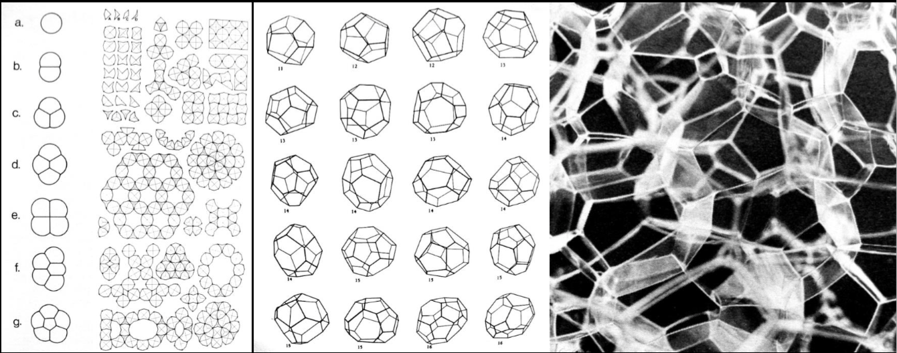

     

<h2>
<big>
Buongiorno!
</big>
</h2>

---

## What will I talk about?

* Technical status of the project

* How will we work in Trento?

* *Everything*

---

     

<h4><big>
  Where we are?
</big></h4>

---

| 1 1 1
| 2 3 3

## We are in between
-
<f-card title="Preparation" :fill="color('gray')" height="calc(5px * 131)" />
-
<f-card title="Production" :fill="color('blue')" height="calc(5px * 131)" />

---

| 1 1 1
| 2 3 3

## Preparation
-
<f-card
  title="Scenario writing"
  :fill="color('gray')"
  height="calc(5px * 50)"
/>
<f-card title="Slide preparation" :fill="color('gray')" height="calc(4.5px * 34)" />
<f-card title="First interactives" :fill="color('gray')" height="calc(4.5px * 23)" />
<f-card title="Testing" :fill="color('gray')" height="calc(4.5px * 10)" />
-
<f-card title="Production" :fill="color('blue')" height="calc(5px * 125)" />

---

| 1 1 1
| 2 3 3

## Production
-
<f-card
  title="Preparation"
  :fill="color('gray')"
  height="calc(5px * 131)"
/>
-
<f-card
  title="30% Content writing / editing"
  height="calc(5px * 30)"
/>
<f-card
  title="20% Media producing"
  height="calc(5px * 20)"
/>
<f-card
  title="20% Light coding / HTML / CSS"
  height="calc(5px * 15)"
/>
<f-card
  title="15% Heavy coding"
  height="calc(5px * 25)"
/>
<f-card
  title="5% User experience design"
  height="calc(5px * 7)"
/>
<f-card
  title="10% Testing + Pedagogy"
  height="calc(5px * 10)"
/>

---

| 1 1 1
| 2 3 3

## Production
-
<f-card
  title="Preparation"
  :fill="color('gray')"
  height="calc(5px * 131)"
/>
-
<f-card
  title="30% Content writing / editing"
  subtitle="All countries"
  height="calc(5px * 30)"
/>
<f-card
  title="20% Media producing"
  subtitle="All countries"
  height="calc(5px * 20)"
/>
<f-card
  title="20% Light coding / HTML / CSS"
  subtitle="🇩🇪 🇵🇹 🇮🇹 🇪🇪"
  height="calc(5px * 15)"
/>
<f-card
  title="15% Heavy coding"
  subtitle="🇪🇪"
  height="calc(5px * 25)"
/>
<f-card
  title="5% User experience design"
  subtitle="🇸🇮 🇪🇪 🇩🇪 🇵🇹"
  height="calc(5px * 7)"
/>
<f-card
  title="10% Testing + Pedagogy"
  subtitle="All + 🇫🇮"
  height="calc(5px * 10)"
/>

---

     

<h1>
Work in Trento
</h1>

---

## Trento work sessions: scenarios

 

#### Focus 
Main focus is on **Italian**, **Greece** and **Slovenian** scenarios.

 

#### Checklists

* **Scenario checklist** by Merit and Kristjan

* **Content quality checklist** by Erik

---

## Work sessions: setup

Let's learn from the Amsterdam workshops. What worked and what did not? 

* Lets have little **more groups**

* Lets to regular **checkins** how each group is doing

* If some group members do not find their *mojo*, lets **regroup?**

---

## Testing

* It is in ~**Thursday**

* Still figuring out the sceduling and test groups

* Different grading of testing

  * **Deep testing**, similar to Netherlands testing. All **scenarios worked on Trento** go here + optional other testable ones.

  * **Light testing**, to get a quick feedback on a scenario

Jaakko + Veera have prepared a online questionnaire using *verkkoon kytketty tietokone*!

---

## Side sessions

Planned for **Thursday afternoon** and **Friday morning** but let's be flexible, we gonna be have more of them in parallel with working sessions.

What will happen in side sessions?
* Every country and **scenario** will receive a **checkup**: current status, next steps with timeline, solving blockers, possible merges etc. 

* **Technology meeting**: Presentation and quick training of tools and frameworks we gonna use. If you speak HTML, join us.

* **Visual style meeting** Lets review a proposal to have a unified design language for the project.

---

     

<h1>
And finally...
</h1>

---
<f-animation-data
  to="360"
  :duration="1000 * 20"
>

<f-scene3 width="400" height="400">
  <f-group3
    v-for="x in range(0,5)"
    :rotation="{y:data.value}"
  >
  <f-group3 v-for="y in range(0,5)"> 
    <f-point3
      v-for="z in range(0,5)"
      :x="scale(x,0,5,-1,1)"
      :y="scale(y,0,5,-1,1)"
      :z="scale(z,0,5,-1,1)"
      stroke-width="15"
      :fill="rgb(
      scale(x,0,5,0,255),
      scale(y,0,5,0,255),
      scale(z,0,5,0,255),
      )"
    />
  </f-group>
  </f-group>
</f-scene>
</f-animation-data>

---

<f-slider-data
  title="Number of rotations"
  step="0.001"
  from="1"
  to="15"
  value="1"
  alternate="true"
>
<f-array-data
  slot-scope="sData"
  :length="(360 * sData.value) / 10"
  :map="(_,i) => ([
    cx(
    i * 10, scale(i,0,(360 * sData.value)/10-1,1.5,0)
    ),
    cy(i * 10,scale(i,0,(360 * sData.value)/10-1,1.5,0))
  ])"
>
  

    <f-scene width="600" height="600">
      <f-circle v-for="(d,i) in data.value"
        :x="d[0]"
        :y="d[1]"
        r="0.03"
        :fill="hsl(i,100,100)"
      />
    </f-scene>
  

</f-array-data>
</f-animation-data>

---

<f-animation-data to="360">

<f-scene grid>
  <f-line
  :points="
    range(-2,2,0.1)
    .map(y =>
    ({y,x:cx(scale(y,-2,2,0,360),1)}))
  "
  opacity="0.5"
  />
  <f-line
    :y1="-2"
    :x1="cx(value,1)"
    :y2="2"
    :x2="cx(value,1)"
    r="0.1"
    :stroke="color('blue')"
    :stroke-width="2"
  />
  <f-circle
    :x="cx(value,1)"
    :y="scale(value,0,360,-2,2)"
    r="0.1"
  />
</f-scene>
 
<f-scene grid>
  <f-circle
    :stroke="color('primary')"
    fill="none"
  />
  <f-line
    :y1="-2"
    :x1="cx(value,1)"
    :y2="2"
    :x2="cx(value,1)"
    r="0.1"
    :stroke="color('blue')"
    :stroke-width="2"
  />
  <f-line
    :x1="-2"
    :y1="cy(value,1)"
    :x2="2"
    :y2="cy(value,1)"
    r="0.1"
    :stroke="color('red')"
    :stroke-width="2"
  />
  <f-circle
    :x="cx(value,1)"
    :y="cy(value,1)"
    r="0.1"
  />
  <f-line
    :x2="cx(value,1)"
    :y2="cy(value,1)"
    r="0.1"
    :stroke="color('primary')"
  />
</f-scene>
<f-scene grid>
  <f-line
  :points="
    range(-2,2,0.1)
    .map(x =>
    ({x,y:cy(scale(x,-2,2,0,360),1)}))
  "
  opacity="0.5"
  />
  <f-line
    :x1="-2"
    :y1="cy(value,1)"
    :x2="2"
    :y2="cy(value,1)"
    r="0.1"
    :stroke="color('red')"
    :stroke-width="2"
  />
  <f-circle
    :x="scale(value,0,360,-2,2)"
    :y="cy(value,1)"
    r="0.1"
  />
</f-scene>

---

| 1 1 2 2 3 3
| 0 4 4 4 4 4

## + nature . concepts

<small style="--emphasis: var(--blue)">
<b>Structure in Nature is a Strategy for Design</b>
 
1980
 
by <b>Peter Pearce</b>
 
http://www.pjpearcedesign.com/
</small>

-
<small style="--emphasis: var(--blue)">
<b>According to Pierce</b> the interaction of intrinsic and extrinsic forces to produce in nature is relatively understandable in the case of inanimate crystals, as interactions tend to be dominated by phenomena of psychology and geometry, the process is much more complex and evasive as the person examines its biological form and its structure. The division between intrinsic and extrinsic forces is not always clear and tends to be hierarchical. That is to say, if we put on a scale a force can be considered extrinsic, but in a larger context, the same force can also
</small>

-

<small>
become intrinsic. This hierarchical phenomenon exists for inanimate and animate structures. For example, a given molecular structure may constitute an intrinsic system of forces that controls the choices of possible crystalline cells by shaping them when they are in association with other cells, and the environment formed by contiguous cells is an extrinsic force that determines which can take the shape of the cell. The interaction of the extrinsic force with the intrinsic force thus forces the molecule and determines the shapes of the cells in a given order.
</small>

-

---

<f-array-data
  length="100"
  :map="() => ({
    x:Math.random(),
    y:Math.random(),
    z:Math.random(),
    size:any([
      Math.random() / 10,
      Math.random() / 10,
      Math.random()
    ])
  })">
  <f-animation-data
    easing="easeInOutSine"
    alternate="true"
    from="-2" to="2"
    value="-2" slot-scope="adata"
  >
  <f-scene3
    slot-scope="sdata"
    width="600"
    height="600"
  >
    <f-group3
      :position="{z: sdata.value}"
      :rotation="{z: sdata.value * 5}"
    >
    <f-polyhedron3
      :rotation="{x: sdata.value * 50}"
    />
    <f-polyhedron3
      :rotation="{y: sdata.value * 500}"
      :scale="0.1"
    />
    <f-point3
      v-for="(p,i) in adata.value"
      :x="scale(p.x,0,1,-2,2)"
      :y="scale(p.y,0,1,-2,2)"
      :z="scale(p.z,0,1,-2,2)"
      :stroke-width="scale(p.size,0,1,1,5)"
      :fill="color('white')"
    />
    </f-group3>
  </f-scene3>
</f-animation-data>
<f-array-data>

  
